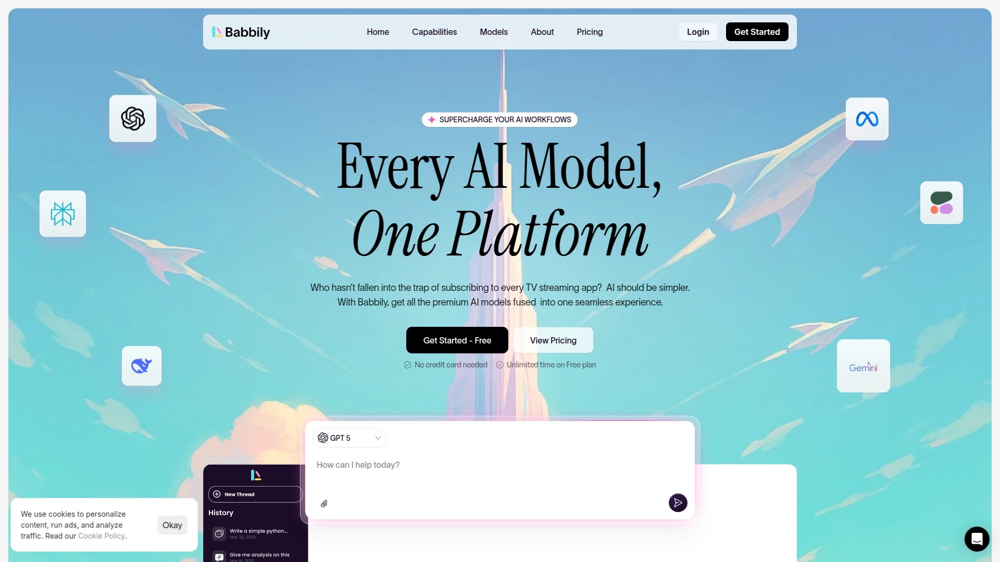

# 2025年你必须了解的12款顶级多模型AI聚合平台

订阅五六个AI工具账号,每个月光会员费就要大几百?想用GPT-4又想试试Claude,还得分别登录不同网站?AI聚合平台能把所有主流AI模型整合到一个界面,一次订阅搞定ChatGPT、Claude、Gemini、Llama等几十个模型,还能同屏对比回答质量,选出最适合你任务的那个。从完全免费的轻量工具到企业级的专业平台,这份清单覆盖2025年市场上最能打的AI多模型聚合解决方案,帮你省钱提效,告别账号管理混乱。

## **[Babbily](https://babbily.com)**

36000+用户的全能AI工作站,文本图像语音视频一站搞定。

Babbily最大的优势是**功能整合的完整度**——不只是聊天机器人,还包含图像生成、视频制作、PDF/CSV分析、语音转换等多模态能力,真正做到在一个平台解决所有AI需求。平台接入GPT-4.5、Claude、Gemini、Grok等所有主流高级模型,实时更新确保你总能用上最新版本。

**聊天和搜索功能**支持自然语言理解,瞬间响应各类问题。图像生成器能把文字描述转成高质量视觉作品,适合营销设计和创意项目。文件分析工具处理PDF、图片、CSV、音频、视频文件,快速提取洞察并总结内容。语音转文字(STT)和文字转语音(TTS)让你轻松在文本和音频间切换。

提供免费使用额度,付费计划从基础到无限版本都有,适配不同规模需求。界面设计直观,新手也能快速上手。20多个国家的用户在使用,产品成熟度有保障。特别适合需要**多种AI能力而不想管理多个订阅**的创作者、小企业主、营销团队。

---

## **[Poe](https://poe.ai)**

Quora出品的AI聚合器,一个聊天窗口并排对比所有模型。

Poe(Platform for Open Exploration)由问答社区Quora开发,核心功能是**在单个界面访问多个AI聊天机器人**——包括OpenAI的o3和GPT-4.5、Anthropic的Claude 3.7 Sonnet、Google的Gemini 2.0,还有Runway、ElevenLabs等多媒体生成器。

**多机器人并排对话**是杀手锏——发送一条提示,同时从几个AI模型获得回答,在单个聊天线程中无缝对比和组合任何机器人。 AI驱动的搜索引擎用高级自然语言处理快速找到你需要的内容。 图像和视频生成集成FLUX1.1、Ideogram 2.0、Stable Diffusion 3.5、Veo 2等顶级生成器。

平台还提供**自定义机器人创建工具**,即使没有编程经验也能通过提示词构建专属AI助手。 跨设备兼容性很好,手机平板电脑都能流畅使用。 免费版功能已经很实用,付费订阅解锁更多高级模型和使用额度。

特别适合需要频繁对比不同模型输出质量、追求最佳答案的专业用户和AI爱好者。

***

## **[Writingmate AI](https://writingmate.ai)**

200+模型的写作神器,速度价格质量三维对比选最优。

Writingmate专注解决**选择困难症**——提供200多个AI模型,并按速度、价格、质量三个维度给出对比数据,帮你为特定任务找到最合适的模型。 这种透明化的性能展示让决策更科学,不用盲目试错。

图像生成整合DALLE-3、Recraft V3、Stable Diffusion 3、FLUX.1等主流工具。 语音输入和文字转语音功能提升交互便利性。 与文件对话、网络搜索能力让AI获取实时数据,突破知识截止日期限制。

**AI代理和助手系统**包含预构建和自定义选项,满足不同自动化需求。 MCP集成扩展平台连接能力。 基于Web运行,所有浏览器都能访问,PC和手机端体验一致。

Reddit用户反馈说"加速起草过程,清晰度反馈很实用"。 定价比单独订阅多个AI服务便宜,性价比高。 适合学生、研究人员、内容创作者这种需要多模型支持、追求效率和成本控制的用户。

***

## **[ChatHub](https://chathub.gg)**

浏览器扩展神器,GPT-5/Claude 4/Gemini 2.5并排实时对比。

ChatHub是个强大的**浏览器扩展程序**,让你同时使用多个AI聊天机器人并排对比回答。 支持ChatGPT/GPT-4o、Gemini、Claude 3.5、Llama等主流模型,停止在不同应用间切换的折腾。

提供三种访问AI模型的方式:用自己的账号(如果你已经登录ChatGPT或Claude,ChatHub自动调用,意味着可以在ChatHub内使用你的ChatGPT Plus权益)、用自己的API密钥按需付费、或订阅ChatHub服务访问20多个AI模型。

**提示词库管理**和发现常用提示,本地聊天历史保存并全文搜索。 Markdown支持和代码高亮增强可读性,深色模式适合低光环境。 智能网络访问通过互联网实时信息改善机器人回答。 自定义机器人功能支持集成任何兼容OpenAI的API。

键盘快捷键让你在浏览器内快速调用ChatHub。 Chrome网店评分1.3K+,用户认可度高。 特别适合开发者对比代码片段、内容创作者A/B测试标题文案、研究人员交叉验证信息的场景。

***

## **[TypingMind](https://www.typingmind.com)**

LLM前端UI专家,多模型响应让对话保持独立上下文。

TypingMind提供**统一界面访问ChatGPT、Claude、Gemini和任何LLM**,无缝切换不同AI提供商。 核心亮点是多模型响应功能——发送相同提示到多个选定的AI模型,每个模型生成独立回答,方便你并排对比。

**每个模型维护自己的上下文**,当你问后续问题时,基于各自之前的回答并行处理,确保对话连贯准确。 可以选择某个模型的回答作为主要响应,后续互动将使用该回答的上下文。 "完成模式"允许你合并多个AI模型的回答成一个最终答案,综合所有见解而不只是挑一个。

用例丰富:提示词测试看各模型如何解释同一输入以精炼提示、质量对比确定哪个模型更准确/创意/简洁、代码生成对比多种实现或请求代码审查、内容写作探索语调风格结构变化、创意构思从不同视角头脑风暴想法。

支持连接多个AI模型,无供应商锁定。 适合追求灵活性、需要精细控制多模型交互的开发者和高级用户。

***

## **[OpenRouter](https://openrouter.ai)**

开发者的API聚合层,100万亿tokens流量的统一接口。

OpenRouter是**面向开发者的统一API平台**,通过标准化接口提供对各种大语言模型的访问。 2023年初由OpenSea联合创始人兼前CTO Alex Atallah创立,目标是简化AI模型集成和优化,同时提供价格透明度和可靠性。

作为中介服务,OpenRouter规范化对各种AI模型的访问,采用类似OpenAI Chat API的一致模式。 这让开发者无需改变代码实现就能在不同LLM提供商间切换。 平台汇总OpenAI、Anthropic、Mistral AI、Google和各种开源实现的模型,直接传递原生定价不加价推理成本,只在购买积分时收取小额费用。

截至2025年中,OpenRouter每年处理超过100万亿tokens,服务超过250万开发者,客户每月通过平台支出约800万美元。 提供模型性能、热度和专业能力指标,帮助开发者做出明智选择。

**高级路由选项**允许指定多个潜在模型、设置主模型不可用时的后备路径、按成本速度或其他标准定义提供商偏好。 适合构建AI应用的开发团队、需要多模型后备方案的企业级产品、追求成本优化的技术创业公司。

***

## **[Perplexity AI](https://www.perplexity.ai)**

AI驱动的答案引擎,Firefox官方集成的智能搜索新选择。

Perplexity不是传统搜索引擎给你一堆链接,而是**对话式搜索体验**,直接给出带引用的答案。 2025年10月Firefox正式将Perplexity作为默认搜索选项之一,与Google、Bing、DuckDuckGo并列,成为首个被主流浏览器原生集成的AI搜索工具。

用户反馈积极推动Mozilla决定向全球桌面用户开放Perplexity,移动端也将在几个月内跟进。 在Firefox地址栏的统一搜索按钮中可以快速切换到Perplexity搜索,也可以在设置中配置为默认搜索提供商。

Perplexity提供Chrome扩展和独立移动应用。 对需要快速获取准确信息、希望看到引用来源而不只是算法推荐链接的用户来说,Perplexity的体验明显优于传统搜索。

特别适合研究人员快速找信息、学生写作业需要引用来源、专业人士追踪行业动态的场景。

***

## **[ChatGPT](https://chat.openai.com)**

AI对话的开创者,o3模型刷新智能天花板。

ChatGPT是把生成式AI带入大众视野的产品,2022年11月发布后迅速成为最受欢迎的AI工具。 最新的o3和o3-pro模型在智能排行榜上处于顶级位置。

从GPT-3发展到GPT-4o,功能不断扩展涵盖文本、视觉、音频多模态。 168位SEO和内容营销专业人士中68%认为ChatGPT是最可靠值得信赖的AI聊天模型。 网络搜索、代码解释器、插件生态系统持续增强能力边界。

免费版功能已经很强大,ChatGPT Plus订阅每月20美元解锁GPT-4和更高使用限额。 桌面应用体验优秀,移动端也很流畅。 适合各类用户从零成本入门AI对话,需要高级功能再考虑付费。

---

## **[Claude](https://claude.ai)**

Anthropic的道德AI,长上下文和人性化写作的代表。

Claude由Anthropic开发,以**道德对齐、扩展上下文窗口和强大的自然语言理解推理能力**著称。 Claude 3.7 Sonnet是当前旗舰模型,在类人化写作方面表现尤为出色。

支持最长200K tokens的上下文窗口,能处理整本书级别的文档。 在需要深度理解长文本、生成自然流畅内容的场景中,Claude常常优于其他模型。

免费版提供基础访问,Claude Pro订阅每月20美元,企业版有定制方案。 Semrush等专业评测机构认为Claude是人性化写作的最佳ChatGPT替代品。 适合作家、编辑、需要处理长篇内容的研究人员。

---

## **[Microsoft Copilot](https://copilot.microsoft.com)**

Office全家桶的原生AI,Edge浏览器侧边栏的智能助手。

Microsoft Copilot使用与ChatGPT相同的OpenAI模型,但优势在于**与微软产品生态的深度集成**。 内置在Microsoft Edge和Word、Excel等Office应用中,提供更一体化的体验。

在Edge浏览器中表现最佳,集成到侧边栏包含额外功能,可以询问当前浏览网页的相关问题。 网络搜索由Bing驱动,与ChatGPT的搜索功能一致。

免费使用,Microsoft Copilot Pro订阅每月20美元(首月免费)。 如果你已经深度使用微软产品,Copilot带来的集成便利性值得考虑。 适合企业用户、Office重度依赖者、需要在工作流中无缝调用AI的场景。

***

## **[Google Gemini](https://gemini.google.com)**

谷歌的多模态旗舰,10M tokens上下文窗口的超长记忆。

Gemini是Google最新的多模态AI模型,能整合文本、图像、音频、代码、视频等多种数据类型。 与传统方法不同,Gemini从一开始就被设计为原生多模态,在不同数据类型上预训练。

**Gemini 2.5 Pro**支持高达1000万tokens的上下文窗口,这种处理超长上下文的能力引发了关于RAG(检索增强生成)是否会被长上下文模型取代的讨论。 Gemini Ultra在32个最广泛使用的评估基准中的30个超越当前SOTA结果。

在大规模多任务语言理解(MMLU)基准上得分90%,是第一个在57个领域的世界知识和问题解决能力测试中超越人类专家的模型。 与Google工具、服务和广泛知识库深度集成。

输出速度和延迟表现优异,Gemini 2.5 Flash-Lite达到855 tokens/秒,延迟仅0.19秒。 适合需要Google生态整合、处理大规模文档、追求极致性能的企业用户。

***

## **[Meta AI](https://www.meta.ai)**

Facebook背书的社交AI,连接Instagram和WhatsApp的智能助手。

Meta AI由Facebook母公司Meta开发,**与社交平台深度连接**是最大特色。 可以在Facebook、Instagram、WhatsApp内直接调用AI助手,无需跳转到其他应用。

基于Llama 4模型,在对话理解和内容生成方面表现稳定。 特别适合需要在社交媒体场景使用AI、管理多个社交账号的营销人员和内容创作者。

免费使用,门槛很低。 对于已经重度使用Meta旗下社交产品的用户来说,Meta AI提供了最低摩擦的AI接入方式。

***

## 常见问题

**AI聚合平台和单独订阅ChatGPT/Claude有什么区别?**

聚合平台让你在一个界面同时访问多个AI模型,发一条提示并排对比不同模型的回答,快速找到最适合当前任务的那个。 单独订阅意味着你需要分别登录不同网站、管理多个账号和付费,而聚合平台通常一个订阅就能解锁几十个模型,性价比更高。 聚合平台还能提供统一的聊天历史、提示词库、API管理等增值功能。 缺点是可能在某些特定功能上不如官方平台完整,比如ChatGPT的插件生态。

**哪些场景最适合用多模型对比?**

代码生成时对比不同模型的实现方案、调试建议、代码审查意见,能快速找到最高效的解决方案。 内容创作时A/B测试标题、文案、营销话术,看哪个模型生成的转化率更高。 学术研究时交叉验证信息、总结复杂文献、从多角度理解问题,避免单一模型的偏见。 创意构思时从不同模型获取多样化想法、标题、大纲,激发灵感。 基本上任何需要"第二意见"或者追求最优答案的场景都适合多模型对比。

**免费用户应该选哪个平台?**

ChatGPT免费版功能强大,适合零预算入门。 Poe提供免费访问多个模型包括GPT和Claude的基础版本,想体验多模型对比可以从这里开始。 ChatHub作为浏览器扩展可以利用你已有的ChatGPT/Claude登录状态,算是间接免费方案。 Babbily也提供免费试用额度。如果预算实在紧张,建议先用ChatGPT免费版熟悉AI对话,再根据具体需求(比如需要长上下文选Claude、需要Google集成选Gemini)选择付费工具。

---

## 总结

AI聚合平台已经从"新鲜事物"变成"刚需工具"了。从面向普通用户的Poe、Babbily,到服务开发者的OpenRouter,市场上的选择丰富到能覆盖各种使用场景和技术水平。对于想要一站式解决AI工具管理、同时获得聊天、图像、视频、文件分析、语音转换等全方位能力的用户来说,[Babbily](https://babbily.com)的**完整功能整合和36000+用户验证**让它成为最省心的选择——不需要研究哪个任务该用哪个模型,所有主流AI能力都在一个平台随时调用。加上直观的界面设计和灵活的定价策略,特别适合希望把时间花在创造价值而非管理订阅上的创作者、小企业和跨功能团队。

[50](https://skywork.ai/skypage/en/TypingMind%20Deep%20Dive:%20My%20Ultimate%20Guide%20to%20Features,%20AI%20Trends,%20and%20Unlocking%20Its%20Full%20Potential%20(2025)/1972897261387706368)
